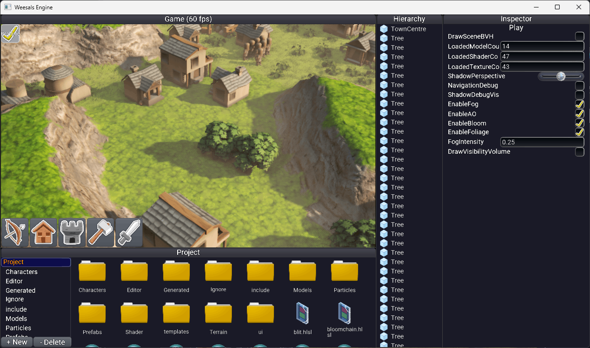

# GameEngine23
Trying out D3D12 and building a central base for future native graphics tests.

- ECS framework
- UI framework
- Sprite atlas
- Cached assets
- Tracey integration
- Terrain/foliage
- Impostors
- Cached draws
- Navmesh
- Texture compression (ispc_texcomp)_)
- FBX importer (ofbx) with animation playback
- Font importer (freetype)

